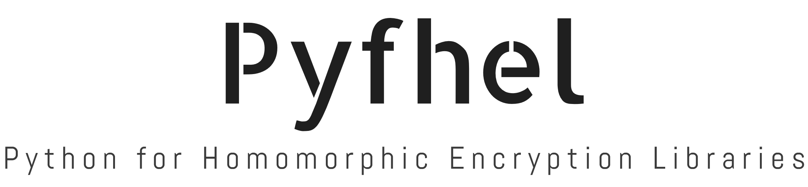

.. Pyfhel documentation master file, created by
   sphinx-quickstart on Mon Aug 27 21:01:48 2018.
   You can adapt this file completely to your liking, but it should at least
   contain the root `toctree` directive.

.. role:: bolditalic
  :class: bolditalic

.. |warning| image:: static/warning_icon.png
    :align: middle
    :width: 20

.. image:: https://travis-ci.org/ibarrond/Pyfhel.svg?branch=master
    :target: https://travis-ci.org/ibarrond/Pyfhel
.. image:: https://badge.fury.io/py/Pyfhel.svg
    :target: https://badge.fury.io/py/Pyfhel
.. image:: https://img.shields.io/badge/Maintained%3F-yes-brightgreen.svg
    :target: https://GitHub.com/ibarrond/Pyfhel/graphs/commit-activity
.. image:: https://img.shields.io/github/issues/ibarrond/Pyfhel.svg
    :target: https://github.com/ibarrond/Pyfhel/issues
.. image:: https://img.shields.io/pypi/pyversions/Pyfhel.svg
    :target: https://pypi.org/project/Pyfhel

**PY**\ thon **F**\ or **H**\ omomorphic **E**\ ncryption **L**\ ibraries, **Pyfhel** implements functionalities of multiple Homomorphic Encryption libraries such as addition, multiplication, exponentiation or scalar product in Python. **Pyfhel** uses a syntax similar to normal arithmetics (+,-,\*). This library is useful both for simple Homomorphic Encryption Demos as well as for complex problems such as Machine Learning algorithms.

**Pyfhel** is built on top of **Afhel**, an **A**\ bstraction **F**\ or **H**\ momorphic **E**\ ncryption **L**\ ibraries in C++. **Afhel** serves as common API for all backends.

* :bolditalic:`Version`: |release|.
* :bolditalic:`Status`: STABLE.
* :bolditalic:`Language`: Python (3.7+) & Cython on top of C++17.
* :bolditalic:`OS`: Windows (tested with ``MSVC2017``, ``MSVC2019``), Linux / WSL (tested on ``gcc6`` upwards) and MacOS (``gcc6`` upwards, NO CLANG).

.. warning::	|warning| *REQUIRED: Python must have been compiled with C++17:* ``g++>=6`` *|* ``MSVC 2017+`` |warning|
	
* :bolditalic:`Dependencies`: There are two possible backends (both shipped alongside Pyfhel), HE libraries in C++:
   
  1.  `SEAL <https://github.com/microsoft/SEAL/>`_ (no external dependencies, default).
  2.  `PALISADE <https://git.njit.edu/palisade/PALISADE.git>`_ (no external dependencies) **WIP**

.. note:: The current version supports `SEAL <https://github.com/microsoft/SEAL/>`_ only

Index
====================

.. toctree::
    :glob:
    :maxdepth: 2
    
    source/getting_started
    _autoexamples/index
    source/API_reference
    source/API_serialized

Glossary and tables
====================

* :ref:`genindex`
* :ref:`search`
